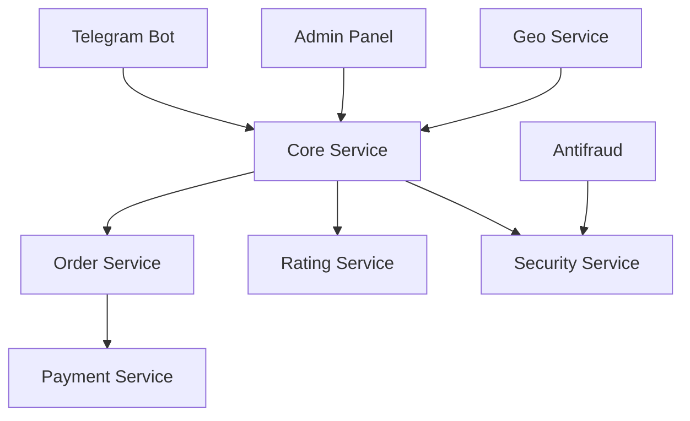

# Архитектура DrillFlow

## Общая структура

```
drillflow/
├── apps/                    # Django приложения
│   ├── core/               # Основная бизнес-логика
│   ├── users/              # Управление пользователями
│   │   ├── contractors/    # Подрядчики
│   │   └── clients/        # Клиенты
│   ├── orders/             # Управление заказами
│   ├── payments/           # Платежная система
│   └── ratings/            # Система рейтингов
├── bot/                    # Telegram бот
├── services/               # Внешние сервисы
│   ├── geo/               # Геолокация
│   ├── antifraud/         # Антифрод
│   └── notifications/     # Уведомления
├── security/              # Безопасность
└── templates/             # Шаблоны Django
```

## Компоненты системы

### Core App
- Бизнес-логика распределения заказов
- Алгоритм приоритезации подрядчиков
- Геолокационный сервис
- Система ограничений и квот

### User Management
- Регистрация и верификация
- Управление профилями
- Система модерации
- Защита от мультиаккаунтинга

### Order System
- Создание и обработка заказов
- Автоматическое распределение
- Таймеры подтверждения
- Статусы и жизненный цикл

### Rating System
- Начисление баллов
- Штрафная система
- Расчет приоритетов
- История изменений

### Payment Processing
- Предоплата 20%
- Интеграция платежных систем
- Возвраты и компенсации
- Учет транзакций

### Security Layer
- Аутентификация и авторизация
- Антифрод система
- DDoS защита
- Шифрование данных

## Взаимодействие компонентов



## Система мониторинга

- ELK Stack для логирования
- Prometheus + Grafana для метрик
- Sentry для отслеживания ошибок

## CI/CD Pipeline

- GitHub Actions для автоматизации
- Docker для контейнеризации
- Автоматическое тестирование
- Линтинг и проверка типов 

## Проблемные места и решения

### Критические точки отказа

1. **Система распределения заказов**
```python
# Текущая проблема в core/distribution.py
def distribute_order(order):
    contractors = get_available_contractors()  # Может вернуть None
    return contractors[0]  # Потенциальный IndexError
```

Решение:
```python
def distribute_order(order):
    contractors = get_available_contractors() or []
    if not contractors:
        log.warning("No available contractors")
        return None
    return contractors[0]
```

2. **Таймер подтверждения заказов**
```python
# Проблема: отсутствие обработки race condition
async def confirm_order(order_id, contractor_id):
    order = await Order.get(order_id)
    if order.status == 'pending':
        order.status = 'confirmed'
        await order.save()
```

Решение:
```python
from django.db import transaction

async def confirm_order(order_id, contractor_id):
    async with transaction.atomic():
        order = await Order.objects.select_for_update().get(order_id)
        if order.status == 'pending':
            order.status = 'confirmed'
            await order.save()
```

### Оптимизация производительности

1. **Кэширование геолокации**
```python
# services/geo/location.py
CACHE_TTL = 60 * 60  # 1 час

async def get_contractor_location(contractor_id):
    cache_key = f"contractor_location:{contractor_id}"
    location = await cache.get(cache_key)
    if not location:
        location = await fetch_location(contractor_id)
        await cache.set(cache_key, location, CACHE_TTL)
    return location
```

2. **Оптимизация запросов к БД**
```python
# Проблема: N+1 запросы
contractors = Contractor.objects.all()
for contractor in contractors:
    orders = contractor.orders.all()  # Отдельный запрос для каждого подрядчика

# Решение:
contractors = Contractor.objects.prefetch_related('orders').all()
```

### Безопасность

1. **Защита от перебора паролей**
```python
from django.core.cache import cache

def verify_login_attempt(user_id):
    key = f"login_attempts:{user_id}"
    attempts = cache.get(key, 0)
    if attempts >= 5:
        raise TooManyAttemptsError()
    cache.set(key, attempts + 1, 300)  # 5 минут блокировки
```

2. **Валидация входных данных**
```python
from pydantic import BaseModel, validator

class OrderCreate(BaseModel):
    address: str
    service_type: str
    description: str = None
    
    @validator('service_type')
    def validate_service_type(cls, v):
        allowed = {'drilling', 'repair', 'sewage'}
        if v not in allowed:
            raise ValueError(f'Invalid service type. Must be one of: {allowed}')
        return v
```

### Мониторинг и логирование

1. **Структурированное логирование**
```python
import structlog

logger = structlog.get_logger()

def process_order(order_id):
    logger.info('processing_order',
        order_id=order_id,
        timestamp=datetime.now(),
        service_type=order.service_type
    )
```

2. **Метрики производительности**
```python
from prometheus_client import Counter, Histogram

order_counter = Counter('orders_total', 'Total orders processed')
distribution_time = Histogram('order_distribution_seconds', 
                            'Time spent distributing orders')

@distribution_time.time()
def distribute_order(order):
    order_counter.inc()
    # логика распределения
```

### Отказоустойчивость

1. **Очереди для асинхронных задач**
```python
from celery import shared_task
from tenacity import retry, stop_after_attempt

@shared_task
@retry(stop=stop_after_attempt(3))
def process_payment(order_id):
    try:
        payment = process_payment_gateway(order_id)
        return payment
    except Exception as e:
        logger.error("Payment failed", order_id=order_id, error=str(e))
        raise
```

2. **Circuit Breaker для внешних сервисов**
```python
from circuitbreaker import circuit

@circuit(failure_threshold=5, recovery_timeout=60)
async def get_geocoding(address):
    try:
        return await maps_client.geocode(address)
    except Exception as e:
        logger.error("Geocoding failed", error=str(e))
        raise
``` 